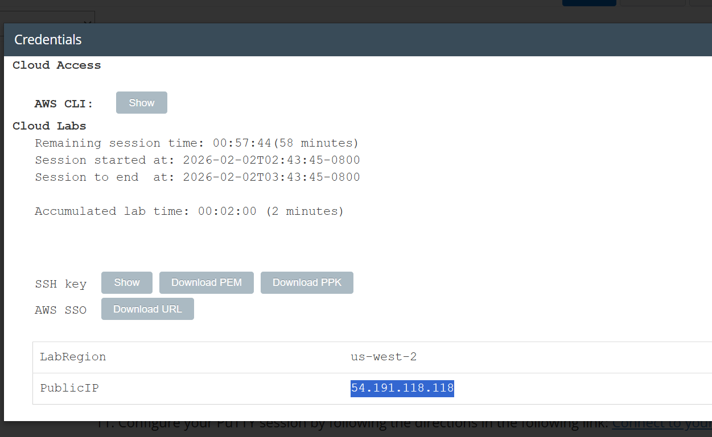

<h1 align="center"> CREATING AN EC2 INSTANCE LAB EXCERCISE </h1> 

<h3> In this lab I used Secure Shell to access an Amazon Linux AMI within Vocareum labs</h3>

 

<b>TASK 1: Use SSH to connect to an Amazon Linux EC2 instance</b>

 This is where I viewed the details of the lab to get the credentials and the IP Address, which I later used to connect to the instance. 

 

<b>TASK 2: Explore the Linux man pages</b>

