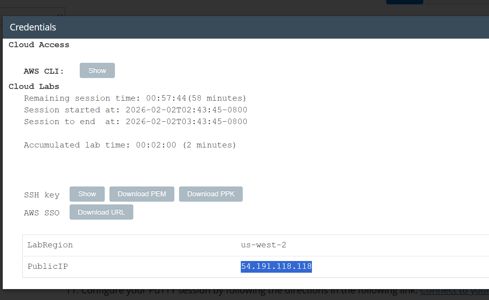

<h1> Introduction to an Amazon Linux Amazon Machine Image (AMI) </h1>

<h3> This lab is designed to reinforce knowledge of basic command line interface functionality and provide a solid foundation for further learning of Linux shell commands and capabilities.
</h3>

 
<h3>Task 1: Use SSH to connect to an Amazon Linux EC2 instance</h3>
  

 
I open the <b>Details</b> drop-down menu and select <b>Show</b> to view the credentials window. I download the <b>labsuser.ppk</b> file and note the <b>Public IP address</b>, then close the panel. I install and open <b>PuTTY</b>, and configure my session using the provided instructions to connect to my Linux EC2 instance via SSH.

