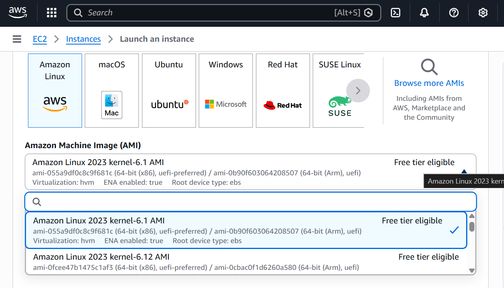

<h1 align="center"> Introduction to Amazon EC2 </h1> 

<h3> This lab provides a basic overview of launching, resizing, managing, and monitoring an Amazon EC2 instance </h3>

 

<h3><b>TASK 1: Launching your EC2 instance </b></h3>
 

1. I opened the AWS Management Console and Select EC2 services where I selected LAUNCH INSTANCE and named my Instance "Web Server"

 

2. This is where I was choosing an AMI (Amazon Machine Image), an AMI provides the information required to launch an instance, which is a virtual server in the cloud. 

 Under AMI Machine Image (AMI), I kept it to Amazon Linux 2023* image.

  

3. This is where I was choosing an instance type.  

