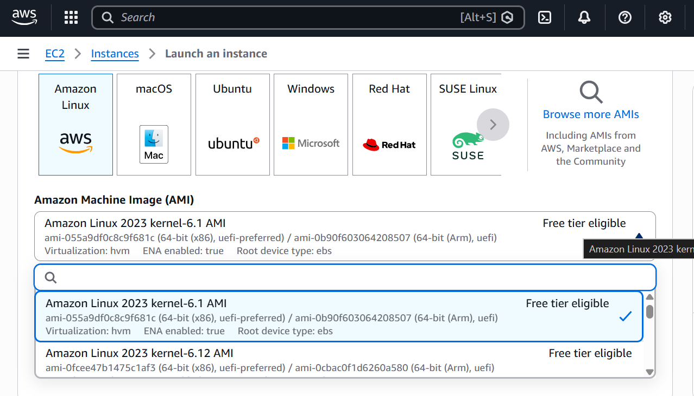
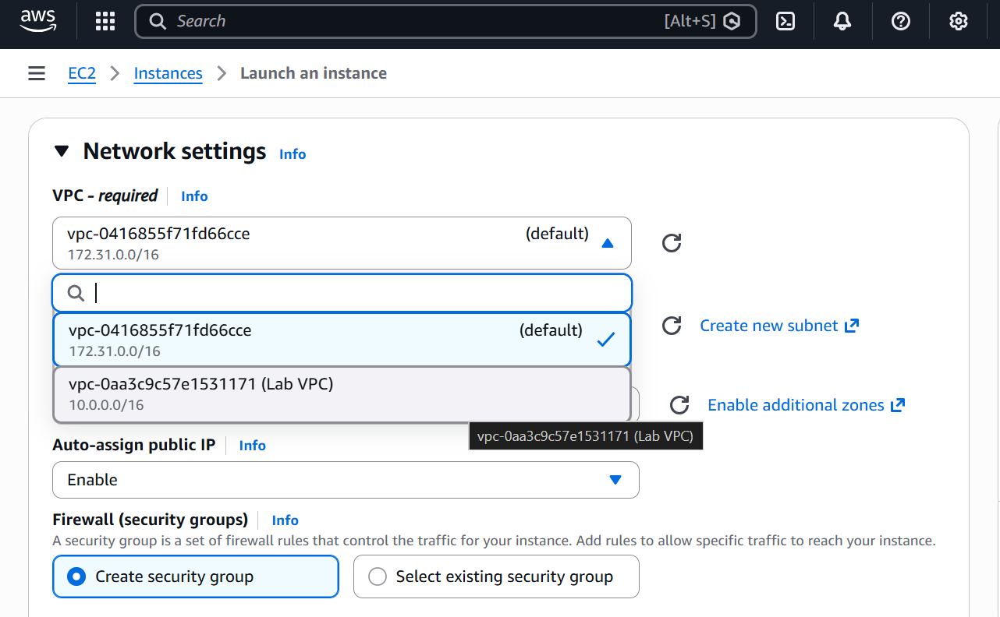
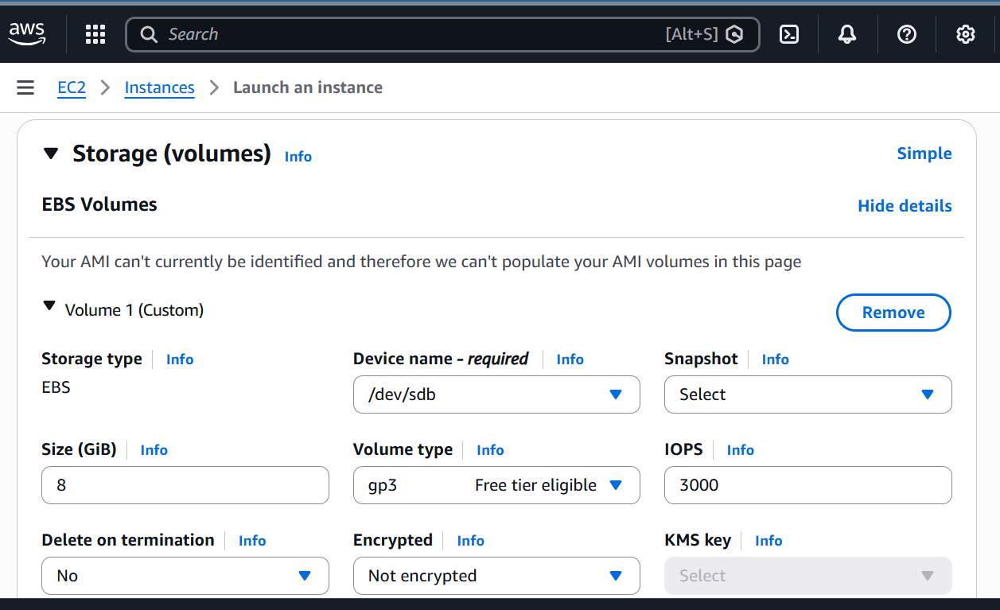
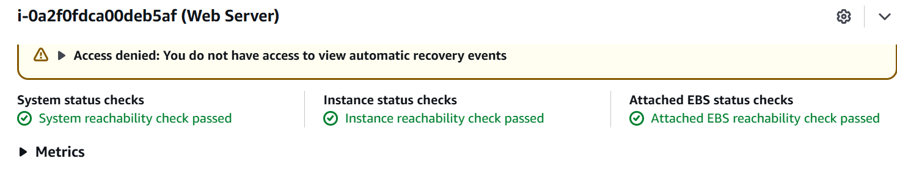
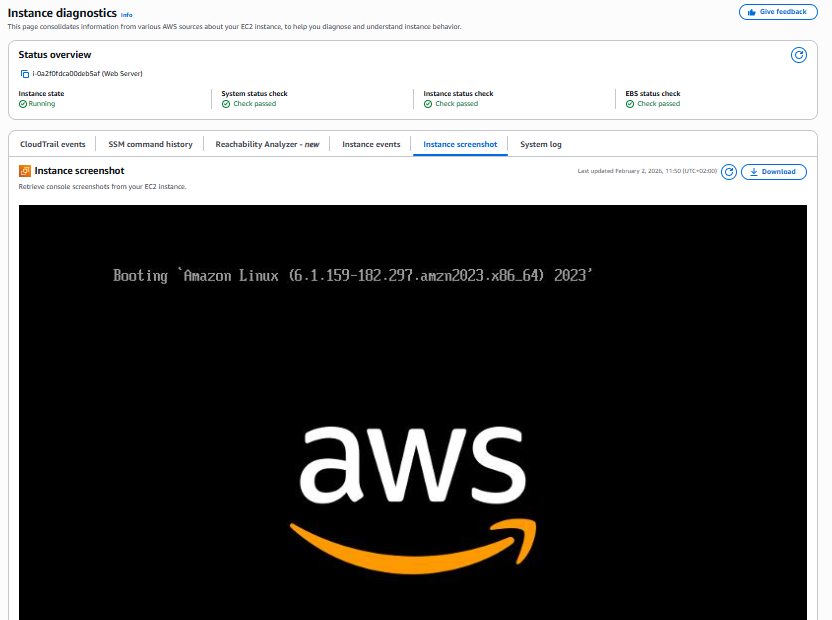

<h1 align="center"> Introduction to Amazon EC2 </h1> 

<h3> This lab provides a basic overview of launching, resizing, managing, and monitoring an Amazon EC2 instance </h3>

 

<h3><b>TASK 1: Launching your EC2 instance </b></h3>
 

1. I opened the AWS Management Console and Select EC2 services where I selected LAUNCH INSTANCE and named my Instance "Web Server"

 
 

2. This is where I was choosing an AMI (Amazon Machine Image), an AMI provides the information required to launch an instance, which is a virtual server in the cloud. 

 Under AMI Machine Image (AMI), I kept it to Amazon Linux 2023* image.

  
 

3. This is where I was choosing an instance type. I selected t3.micro instance  

 
 

4. Configuring a key pair: Selected proceed without 

 
 

5. Configuring the network settings: for VPC I selected Lab VPC

 
 

 Security Group name : Web Security Group

Description: Security Group for my web server

 A security group acts as a virtual firewall that controls the traffic for one or more instances. When you launch an instance, you associate one or more security groups with the instance. 

 
 

6. Adding Storage: Amazon EC2 stores data on a network-attached virtual disk called Amazon Elastic Block Store (Amazon EBS). EC2 instance is a default 8 GiB disk volume

 
 

 7. Configuring Advance details:This is where I enabled Termination Protection and entered the commands to the user data text box 

The script does the following: Install an Apache web server (httpd) , Configure the web server to automatically start on boot , Activate the Web server, Create a simple web page

 
 

 8. This is where I launched my EC2 Instance. I launched my EC2 instance by clicking <b>Launch instance</b> and then view it in the instances list. The instance first shows as <b>Pending</b>, then changes to <b>Running</b> once it starts. After a short wait, it becomes accessible and gets a <b>public DNS name</b> for internet access. I waited until its status shows <b>Running</b> with <b>2/2 checks passed</b> to confirm it’s fully ready.

 
 
<h3><b>TASK 2: Monitor your Instance </b></h3>
 

 1. I monitor my EC2 instance to ensure it is reliable, available, and performing well. I select the instance and check the <b>Status checks</b> tab to see its condition. This helps me quickly identify any hardware or software issues. I confirm that both the <b>system reachability</b> and <b>instance reachability</b> checks have passed, meaning my instance is running properly.

  

 2. I select the <b>Monitoring</b> tab to view metrics from Amazon CloudWatch for my EC2 instance. Since the instance is new, there are only a few metrics available, but I can click on a graph to see more details. I understand that Amazon EC2 sends basic monitoring data every five minutes by default, and I can enable detailed one-minute monitoring if needed. I also use the <b>Monitor and troubleshoot</b> option to get an instance screenshot, which shows what the instance console looks like as if a screen were connected.

 
 
<h3><b>TASK 3: Update Your Security Group and Access the Web Server </b></h3>
 
