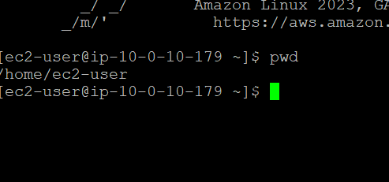
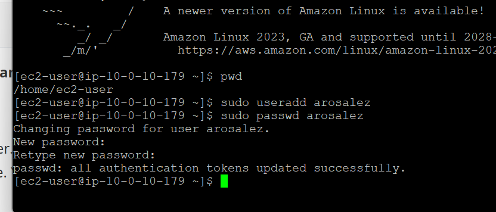
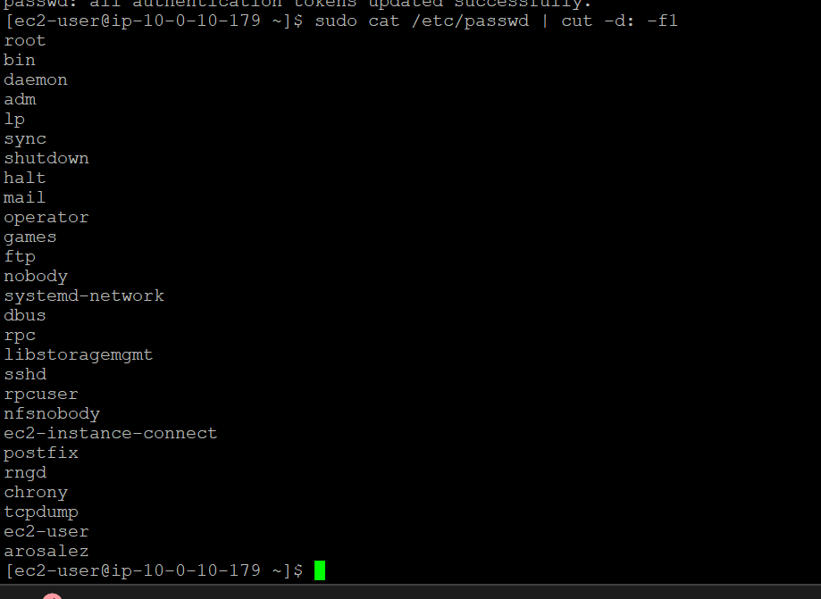
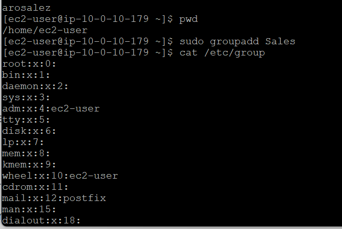

<h1>Managing Users and Groups</h1>

<h3> In this lab, users create new user accounts with a default password, set up groups, and assign the appropriate users to those groups. They also log in as different users to verify and test the configurations. </h3>

 

<h3>TASK 1: Using SSH to Connect </h3>
 

 I open the <b>Details</b> drop-down menu and select <b>Show</b> to access the credentials window. I download the <b>labsuser.ppk</b> file and save it, usually in my Downloads folder. I also note the <b>Public IP address</b> and close the details panel. I then download and open <b>PuTTY</b>, and configure it using the provided instructions to connect to my Amazon EC2 Linux instance via SSH. Windows users can skip ahead to the next task.

 

<h3>TASK 2: Create Users </h3>
 

 1. I validate that I am in the home directory of my current user by using the `pwd` command, which displays the path `/home/ec2-user`. 

  

 2. I create the first user, <b>arosalez</b>, by using the `sudo useradd` command. I then set a password for the account with `sudo passwd arosalez`, entering the password twice to confirm it. While typing the password, nothing appears on the screen, so I type it carefully and press Enter.

  

 3. I validate that the users were created by running a command to view usernames from the `/etc/passwd` file. This confirms that both <b>ec2-user</b> and <b>arosalez</b> exist. The command helps me clearly view created users in a simpler format.
 

  

 4. I validate that all users have been created by running a command to display usernames from the `/etc/passwd` file. This confirms that all listed user accounts were successfully added to the system.

 

<h3>TASK 3: Create Groups </h3>
 

 1. I confirm that I am in my current user’s home directory using the `pwd` command. I then create the <b>Sales</b> group with `sudo groupadd Sales` and verify that it was successfully added by checking the `/etc/group` file. I also note that the system automatically created a separate group for each user added earlier.

