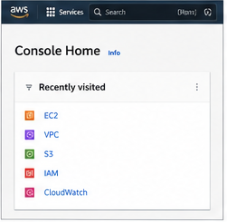
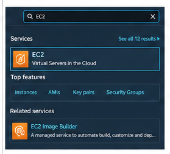
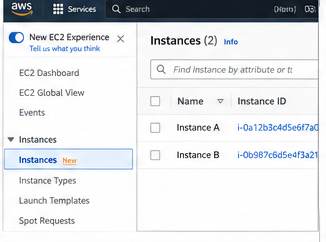
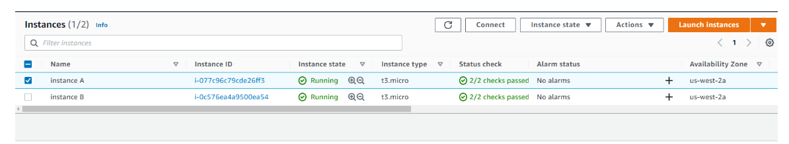
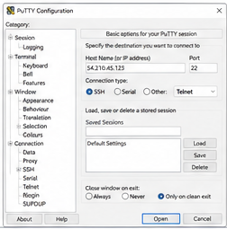
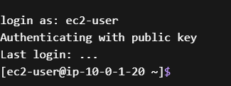

<h1>Internet Protocols - Public and Private IP addresses</h1>

<h3> In this lab, summarizes and investigates a customer scenario, analyze the differences between private and public IP addresses, develop a solution to the customer’s issue, and summarize their findings through a group activity.
</h3>

 

<h3>TASK 1: Investigate the customer's environment </h3>
 

1. I first opened AWS Management Console, and opened EC2 service once the management console had opened. 

   

 2. On the EC2 Dashboard from the left navigation pane, I selected Instances. Where there was two instances running. 

   

 3. I copy the names and IP addresses of both EC2 instances into a text editor for future reference. I select <b>Instance A</b>, open the <b>Networking</b> tab, and record its public and private IPv4 addresses, along with the VPC and subnet details. I then repeat the same process for <b>Instance B</b> and compare the information to identify any differences between the two instances. 

 

<h3>TASK 2: Use SSH to connect to an Amazon Linux EC2 instance </h3>
 

1. I selected the Details dropdown and clicked Show. Downloaded the labsuser.ppk file. And noted the Public IP Address. 

   

 2. I download <b>PuTTY</b> to use SSH for connecting to the Amazon EC2 instance, then open <b>putty.exe</b> to begin the connection setup. 

   

3. I configured my Putty to connect to my Linux instance. I entered: <b>Host Name: ec2-user@Public-IP-of-Instance-B</b> and <b>Port: 22 </b> Then I went to: <b>Connection > SSH > Auth </b> and browsed for the labsuser.ppk key file. 

   

4. To connect to Instance B. 

login as: ec2-user
Authenticating with public key
Last login: ...
[ec2-user@ip-10-0-1-20 ~]$

   

5. Attempt Connection to Instance A 

 I attempted SSH to Instance A. But conuldnt connect. Instance A only has a private IP address, which cannot be reached from outside the VPC. 

